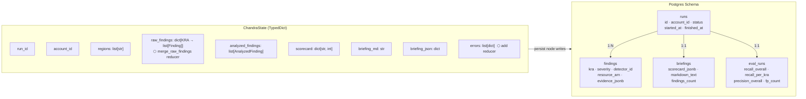

# Chandra — Digital Cloud Engineer

Autonomous AWS observation agent that emits a daily Cloud Health Briefing covering five KRAs:
**cost, security, compliance, performance, reliability**.

- **Orchestration:** LangGraph with a `PostgresSaver` checkpointer.
- **LLM:** Claude Sonnet via Amazon Bedrock (`langchain_aws.ChatBedrockConverse`). Tools detect, LLM ranks and narrates.
- **AWS SDK:** boto3 with adaptive retry, paginated everywhere.
- **State:** Postgres (RDS in prod, container in dev).
- **Dashboard:** Streamlit (latest briefing, findings explorer, eval trend).
- **Synthetic env:** Terraform module set that seeds 10 known misconfigs for eval.

## Architecture

### LangGraph Observation Pipeline

```mermaid
flowchart TD
    START([▶ START]) --> onboard["🔑 onboard_account\n resolve account ID + regions"]
    onboard --> fanout{"⚡ fanout_observers\n Send per KRA"}

    fanout -->|parallel| cost["💰 observe_cost\ntools/cost.py"]
    fanout -->|parallel| security["🔒 observe_security\ntools/security.py"]
    fanout -->|parallel| compliance["📋 observe_compliance\ntools/compliance.py"]
    fanout -->|parallel| performance["⚡ observe_performance\ntools/performance.py"]
    fanout -->|parallel| reliability["🛡️ observe_reliability\ntools/reliability.py"]

    cost -->|list[Finding]| analyze
    security -->|list[Finding]| analyze
    compliance -->|list[Finding]| analyze
    performance -->|list[Finding]| analyze
    reliability -->|list[Finding]| analyze

    analyze["🤖 analyze\nLLM rank + dedup\n+ scorecard math"] --> compose["📝 compose_briefing\nLLM executive summary\n+ Markdown/JSON render"]
    compose --> persist["💾 persist\nwrite Run, Finding,\nBriefing rows"]
    persist --> END([⏹ END])

    style START fill:#22c55e,color:#fff
    style END fill:#ef4444,color:#fff
    style fanout fill:#f59e0b,color:#fff
    style analyze fill:#8b5cf6,color:#fff
    style compose fill:#8b5cf6,color:#fff
```

### Full System Architecture

```mermaid
flowchart TB
    subgraph CLI["🖥️ CLI  (cli.py — Typer)"]
        run_cmd["chandra run"]
        eval_cmd["chandra eval"]
        render_cmd["chandra render"]
    end

    subgraph Graph["🔄 LangGraph Pipeline  (graphs/)"]
        direction TB
        G1[onboard_account]
        G2["observe_* ×5\n(parallel branches)"]
        G3[analyze]
        G4[compose_briefing]
        G5[persist]
        G1 --> G2 --> G3 --> G4 --> G5
    end

    subgraph Tools["🔧 KRA Detectors  (tools/)  — boto3 only, no LLM"]
        T1[cost.py]
        T2[security.py]
        T3[compliance.py]
        T4[performance.py]
        T5[reliability.py]
        TBASE[base.py\nDetectorContext\npaginate()]
    end

    subgraph Briefing["📄 Briefing  (briefing/)"]
        B1[composer.py\nllm_rank · score_findings\nrender_markdown]
        B2[schemas.py\nFinding · AnalyzedFinding\nScorecard · BriefingPayload]
    end

    subgraph AWS["☁️ AWS Layer  (aws/)"]
        A1[client_factory.py\nAwsClientFactory\nadaptive retry]
        A2[regions.py\nactive_regions()]
    end

    subgraph LLM["🤖 LLM  (Amazon Bedrock)"]
        L1["Claude Sonnet\nvia ChatBedrockConverse"]
        L2["prompts/\nanalyzer.md · briefer.md\nobserver.md"]
    end

    subgraph DB["🗄️ Persistence  (db/ + Postgres)"]
        D1[session.py\nsession_scope()]
        D2["models.py\nRun · Finding\nBriefing · EvalRun"]
        D3["Alembic migrations"]
        CP["PostgresSaver\n(LangGraph checkpointer)"]
    end

    subgraph Dashboard["📊 Dashboard  (dashboard/app.py)"]
        Dash["Streamlit\nLatest briefing\nFindings explorer\nEval trend"]
    end

    subgraph Evals["🧪 Eval Harness  (evals/)"]
        EH[harness.py]
        SM[seed_manifest.yaml\n10 seeded misconfigs]
        ER["reports/\nbriefing-*.md + .json"]
    end

    subgraph IAC["🏗️ Infrastructure  (iac/synthetic_env/)"]
        TF["Terraform modules\n10 known misconfigs\nseeded in burner AWS"]
    end

    run_cmd --> Graph
    eval_cmd --> EH
    render_cmd --> DB

    Graph --> Tools
    Graph --> Briefing
    Graph --> DB

    Tools --> AWS
    Tools --> TBASE
    Briefing --> LLM
    Briefing --> B2
    LLM --> L2

    DB --> D1
    DB --> D2
    DB --> D3
    Graph -.->|checkpointing| CP
    CP --> DB

    Dashboard --> DB
    EH --> Graph
    EH --> SM
    EH --> ER
    IAC --> AWS
```

### State Flow & Data Model



Observers fan out via `Send(...)`. Each observer calls a deterministic boto3 tool module and returns
`list[Finding]`. The LLM is invoked only in `analyze` and `compose_briefing` — it **never invents findings**.

## Success bar

- ≥80% recall overall on the 10 seeded misconfigurations.
- ≥70% recall per individual KRA.
- End-to-end run under 8 minutes on a fresh burner.
- Briefing renders in Streamlit and exports clean Markdown + JSON.

## Prerequisites

- Python 3.12, [uv](https://github.com/astral-sh/uv)
- Docker (for local Postgres + LocalStack)
- Terraform ≥ 1.5
- AWS CLI with credentials to a **burner / sandbox** account (the synthetic env applies real AWS resources)
- Amazon Bedrock model access for `anthropic.claude-sonnet-4-5-20250929-v1:0` in your default region

## Demo run-through (≈ 10 minutes)

```bash
# 1. Configure environment.
cp .env.example .env
# Then edit .env to set AWS_PROFILE and SYNTHETIC_ACCOUNT_ID (your burner account id).

# 2. Bring up Postgres + install deps + migrate.
make db-up
make install
make migrate

# 3. Stand up the synthetic env (real AWS resources in your burner).
make tf-apply

# 4. One Chandra run end-to-end.
make run
# → writes briefing-{run_id}.md and briefing-{run_id}.json to evals/reports/

# 5. Score recall vs seed_manifest.yaml.
CHANDRA_STALE_KEY_DAYS_OVERRIDE=0 make eval
# → exit 0 only if recall_overall ≥ 0.80 AND every per-KRA recall ≥ 0.70.

# 6. Open the dashboard.
make dashboard
# → http://localhost:8501
```

Or, one shot:

```bash
make smoke           # Linux/macOS
# or
make smoke-windows   # PowerShell
```

When you're done with the burner:

```bash
make tf-destroy
```

## Layout

```
chandra/
├── src/chandra/
│   ├── config.py                   # pydantic Settings
│   ├── logging.py                  # structlog setup
│   ├── aws/                        # client factory + region discovery
│   ├── tools/                      # KRA detectors (deterministic boto3)
│   ├── graphs/                     # LangGraph state + nodes + builder
│   ├── prompts/                    # observer.md, analyzer.md, briefer.md
│   ├── briefing/                   # composer + pydantic schemas
│   ├── db/                         # SQLAlchemy models + alembic migrations
│   ├── dashboard/app.py            # Streamlit dashboard
│   └── cli.py                      # chandra {run, eval, render}
├── iac/synthetic_env/              # Terraform — seeds 10 misconfigs
├── evals/
│   ├── seed_manifest.yaml          # ground truth + thresholds
│   ├── harness.py                  # terraform apply → run → score → report
│   └── reports/                    # JSON + Markdown reports per run
├── tests/                          # moto-driven unit tests for every detector
├── scripts/smoke.{sh,ps1}          # one-shot demo runner
├── docker-compose.yml              # Postgres + LocalStack for local dev
└── Dockerfile                      # multi-stage slim runtime image
```

## Quality gates

`make check` runs ruff + mypy --strict + pytest. Don't commit on red. The repo enforces:

- No `# TODO: implement` in committed code.
- Tools never call Bedrock — only `briefing.composer` does.
- Writes to Postgres only inside the `persist` node and migrations.
- Boto3 paginators on every list/describe call.

## License

Proprietary — internal use only.
