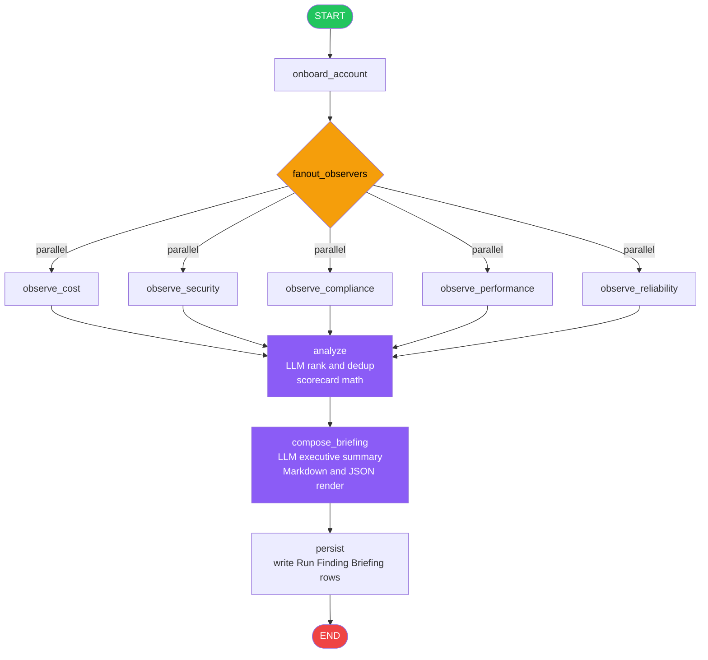
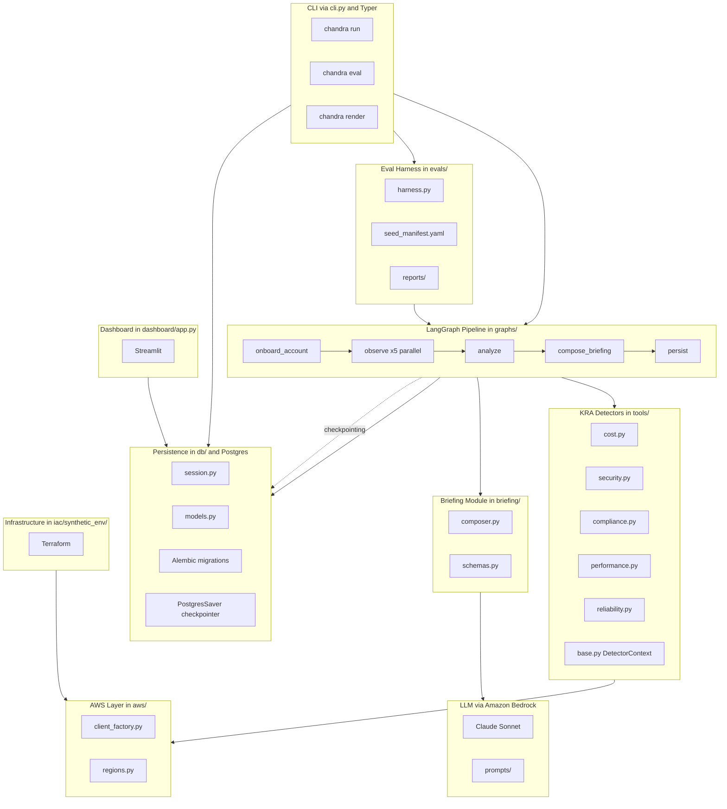
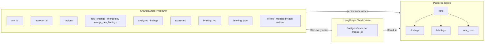

# Chandra — Digital Cloud Engineer

Autonomous AWS observation agent that emits a daily Cloud Health Briefing covering five KRAs:
**cost, security, compliance, performance, reliability**.

- **Orchestration:** LangGraph with a `PostgresSaver` checkpointer.
- **LLM:** Claude Sonnet via Amazon Bedrock (`langchain_aws.ChatBedrockConverse`). Tools detect, LLM ranks and narrates.
- **AWS SDK:** boto3 with adaptive retry, paginated everywhere.
- **State:** Postgres (RDS in prod, container in dev).
- **Dashboard:** Streamlit (latest briefing, findings explorer, eval trend).
- **Synthetic env:** Terraform module set that seeds 10 known misconfigs for eval.

## Architecture

### LangGraph Observation Pipeline



### Full System Architecture



### State Flow and Data Model



Observers fan out via `Send(...)`. Each observer calls a deterministic boto3 tool module and returns
`list[Finding]`. The LLM is invoked only in `analyze` and `compose_briefing` — it **never invents findings**.

## Success bar

- ≥80% recall overall on the 10 seeded misconfigurations.
- ≥70% recall per individual KRA.
- End-to-end run under 8 minutes on a fresh burner.
- Briefing renders in Streamlit and exports clean Markdown + JSON.

## Prerequisites

- Python 3.12, [uv](https://github.com/astral-sh/uv)
- Docker (for local Postgres + LocalStack)
- Terraform ≥ 1.5
- AWS CLI with credentials to a **burner / sandbox** account (the synthetic env applies real AWS resources)
- Amazon Bedrock model access for `anthropic.claude-sonnet-4-5-20250929-v1:0` in your default region

## Demo run-through (≈ 10 minutes)

```bash
# 1. Configure environment.
cp .env.example .env
# Then edit .env to set AWS_PROFILE and SYNTHETIC_ACCOUNT_ID (your burner account id).

# 2. Bring up Postgres + install deps + migrate.
make db-up
make install
make migrate

# 3. Stand up the synthetic env (real AWS resources in your burner).
make tf-apply

# 4. One Chandra run end-to-end.
make run
# → writes briefing-{run_id}.md and briefing-{run_id}.json to evals/reports/

# 5. Score recall vs seed_manifest.yaml.
CHANDRA_STALE_KEY_DAYS_OVERRIDE=0 make eval
# → exit 0 only if recall_overall ≥ 0.80 AND every per-KRA recall ≥ 0.70.

# 6. Open the dashboard.
make dashboard
# → http://localhost:8501
```

Or, one shot:

```bash
make smoke           # Linux/macOS
# or
make smoke-windows   # PowerShell
```

When you're done with the burner:

```bash
make tf-destroy
```

## Layout

```
chandra/
├── src/chandra/
│   ├── config.py                   # pydantic Settings
│   ├── logging.py                  # structlog setup
│   ├── aws/                        # client factory + region discovery
│   ├── tools/                      # KRA detectors (deterministic boto3)
│   ├── graphs/                     # LangGraph state + nodes + builder
│   ├── prompts/                    # observer.md, analyzer.md, briefer.md
│   ├── briefing/                   # composer + pydantic schemas
│   ├── db/                         # SQLAlchemy models + alembic migrations
│   ├── dashboard/app.py            # Streamlit dashboard
│   └── cli.py                      # chandra {run, eval, render}
├── iac/synthetic_env/              # Terraform — seeds 10 misconfigs
├── evals/
│   ├── seed_manifest.yaml          # ground truth + thresholds
│   ├── harness.py                  # terraform apply → run → score → report
│   └── reports/                    # JSON + Markdown reports per run
├── tests/                          # moto-driven unit tests for every detector
├── scripts/smoke.{sh,ps1}          # one-shot demo runner
├── docker-compose.yml              # Postgres + LocalStack for local dev
└── Dockerfile                      # multi-stage slim runtime image
```

## Quality gates

`make check` runs ruff + mypy --strict + pytest. Don't commit on red. The repo enforces:

- No `# TODO: implement` in committed code.
- Tools never call Bedrock — only `briefing.composer` does.
- Writes to Postgres only inside the `persist` node and migrations.
- Boto3 paginators on every list/describe call.

## License

Proprietary — internal use only.
