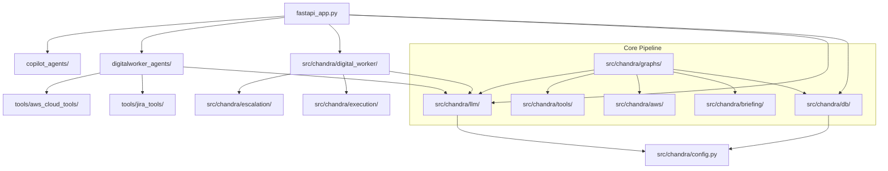

# Source Code Documentation — Chandra Enterprise Digital Cloud Engineer

**Date:** 2026-07-30  
**Branch:** `feature/local-llm`  
**Total Python files:** 120+  
**Total TypeScript files:** 40+ (frontend/)

---

## 1. Repository Structure

```
chandra/
├── app.py                          # Gradio app entry point (legacy)
├── fastapi_app.py                  # FastAPI backend (2412 lines)
├── run.py                          # Local pipeline runner
├── start.sh                        # Docker container entry point
├── pyproject.toml                  # Python project config
├── Makefile                        # Dev commands
├── CLAUDE.md                       # Claude Code context
├── docker-compose.yml              # Deployment orchestration
├── Dockerfile                      # Multi-stage build
├── nginx.conf                      # Reverse proxy config
├── .env.example                    # Environment template
│
├── src/chandra/                    # Core Python package
│   ├── __init__.py
│   ├── config.py                   # Settings (pydantic-settings)
│   ├── logging.py                  # Structured logging
│   ├── llm.py                      # Legacy LLM import
│   ├── cli.py                      # Typer CLI (chandra run/eval)
│   │
│   ├── llm/                        # LLM abstraction layer
│   │   ├── __init__.py             # build_chat_model factory + fallback
│   │   ├── providers.py            # BaseLLM abstract class, VLLM/Ollama/Bedrock
│   │   └── token_counter.py        # Token budget management
│   │
│   ├── graphs/                     # LangGraph graphs
│   │   ├── chandra_graph.py        # Core 12-node graph
│   │   ├── state.py                # ChandraState TypedDict
│   │   ├── nodes.py                # Node functions (legacy)
│   │   ├── checkpointer.py         # Postgres/Memory checkpointer
│   │   └── action_nodes/           # Individual node functions
│   │       ├── action_executor.py  # Executes auto-fix actions
│   │       └── __init__.py         # Re-exports all nodes
│   │
│   ├── aws/                        # AWS integration
│   │   ├── client_factory.py       # Boto3 client factory
│   │   ├── regions.py              # Region discovery
│   │   ├── cloudtrail_audit.py     # CloudTrail audit
│   │   ├── config_compliance.py    # AWS Config compliance
│   │   ├── encryption_checks.py    # Encryption verification
│   │   ├── organizations.py        # AWS Organizations
│   │   ├── compliance_models.py    # Compliance data models
│   │   ├── security_models.py      # Security data models
│   │   └── helpers.py              # Shared utilities
│   │
│   ├── tools/                      # AWS detectors (5 KRAs)
│   │   ├── base.py
│   │   ├── cost.py                 # Cost optimization
│   │   ├── security.py             # Security findings
│   │   ├── compliance.py           # Compliance findings
│   │   ├── performance.py          # Performance findings
│   │   └── reliability.py          # Reliability findings
│   │
│   ├── briefing/                   # Briefing composer
│   │   ├── composer.py             # LLM narrative generation
│   │   ├── org_summary.py          # Org-level summary
│   │   └── schemas.py              # Briefing schemas
│   │
│   ├── digital_worker/             # Digital Worker graph
│   │   ├── graph.py                # 15-node LangGraph
│   │   ├── state.py                # DigitalWorkerState
│   │   ├── intake.py               # Omnichannel request intake
│   │   ├── classifier.py           # Request classification
│   │   ├── context.py              # Context collection
│   │   ├── planner.py              # Resolution planning
│   │   ├── guidance.py             # Guidance generation
│   │   ├── risk.py                 # Risk assessment
│   │   ├── decision_engine.py      # Decision routing
│   │   ├── verifier.py             # Result verification
│   │   ├── tracker.py              # Request tracking
│   │   ├── notifications.py        # Slack/Teams/Email notifications
│   │   ├── memory.py               # Persistence
│   │   ├── schemas.py              # Data schemas
│   │   └── __init__.py
│   │
│   ├── execution/                  # Execution engine
│   │   ├── planner.py              # Execution plan generation
│   │   ├── executor.py             # Plan execution
│   │   ├── terraform.py            # Terraform operations
│   │   ├── validator.py            # Plan validation
│   │   ├── verification.py         # Post-execution verification
│   │   ├── bridge.py               # Execution bridge
│   │   └── schemas.py              # Action schemas
│   │
│   ├── escalation/                 # Escalation management
│   │   ├── publisher.py            # SNS publishing
│   │   ├── formatter.py            # Escalation formatting
│   │   └── schemas.py              # Escalation schemas
│   │
│   ├── observability/              # Observability
│   │   ├── callbacks.py            # LangChain callbacks
│   │   └── pricing.py              # Bedrock cost tracking
│   │
│   ├── dashboard/                  # Streamlit dashboard (legacy)
│   │   └── app.py
│   │
│   └── db/                         # Database layer
│       ├── models.py               # SQLAlchemy models
│       ├── session.py              # Session management
│       └── migrations/             # Alembic
│           ├── env.py
│           └── versions/           # 3 migrations
│
├── digitalworker_agents/           # Legacy digital worker agents
│   ├── aws_execution_agent.py      # Execution agent (3709 lines)
│   ├── observation_agent.py        # Observation agent (470 lines)
│   └── analyzer_agent.py           # Analyzer agent (303 lines)
│
├── copilot_agents/                 # Copilot chat agent
│   ├── graph.py                    # LangGraph chat
│   └── call_tools.py               # Tool calling
│
├── tools/                          # Legacy tools
│   ├── aws_cloud_tools/            # AWS cloud tools
│   │   ├── cost_explorer.py
│   │   ├── metrics_fetcher.py
│   │   ├── tool_findings.py
│   │   ├── cloud_trail_fetcher.py
│   │   ├── guardduty_fetcher.py
│   │   ├── budgets_fetcher.py
│   │   ├── health_events_fetcher.py
│   │   └── ...
│   └── jira_tools/                 # Jira integration
│       ├── read_jira_ticket.py
│       └── create_jira_ticket.py
│
├── frontend/                       # Next.js 16 + React 18
│   ├── package.json
│   ├── next.config.js
│   ├── tsconfig.json
│   ├── src/
│   │   ├── app/                    # Next.js app router
│   │   ├── components/             # React components
│   │   └── lib/                    # Utilities
│   └── public/                     # Static assets
│
├── tests/                          # Test suite
│   ├── unit/                       # 28 unit test files
│   ├── integration/                # 5 integration test files
│   ├── test_nodes/                 # Node test files (14)
│   └── conftest.py                 # Pytest fixtures
│
├── scripts/                        # Utility scripts
│   ├── benchmark_llm.py            # LLM benchmark harness
│   ├── healthcheck.py              # Docker HEALTHCHECK
│   ├── smoke.sh                    # Smoke test
│   └── destroy_terraform.py        # Cleanup
│
├── evals/                          # Evaluation
│   ├── fixtures/                   # Benchmark fixtures
│   └── reports/                    # Benchmark reports
│
├── iac/                            # Infrastructure as Code
│   └── synthetic_env/              # Synthetic AWS environment
│
├── docs/                           # Documentation
│   └── handover/                   # Handover documents (17 files)
│
└── logs/                           # Runtime logs
```

---

## 2. Key Module Dependencies



---

## 3. Import Conventions

### LLM Access (ALWAYS use factory)
```python
# CORRECT
from src.chandra.llm import build_chat_model, get_llm, get_llm_with_tools
from src.chandra.llm.providers import get_provider, BaseLLM

# WRONG — never import directly
from langchain_aws import ChatBedrockConverse  # NO
from langchain_openai import ChatOpenAI  # NO
```

### AWS Client (ALWAYS use factory)
```python
# CORRECT
from src.chandra.aws.client_factory import get_default_factory
factory = get_default_factory()
ec2 = factory.get_client("ec2")

# WRONG — never use boto3 directly
import boto3  # NO (except in client_factory)
ec2 = boto3.client("ec2")  # NO
```

### Database Session
```python
# CORRECT
from src.chandra.db.session import session_scope
with session_scope() as session:
    session.query(Run).all()

# WRONG — manage sessions manually
from sqlalchemy.orm import Session  # NO
```

---

## 4. Environment Variables

| Variable | Default | Required | Description |
|----------|---------|----------|-------------|
| `AWS_DEFAULT_REGION` | us-east-1 | Yes | AWS region |
| `AWS_ACCESS_KEY_ID` | - | Yes | AWS access key |
| `AWS_SECRET_ACCESS_KEY` | - | Yes | AWS secret key |
| `LLM_PROVIDER` | bedrock | Yes | bedrock, vllm, openai, ollama |
| `LLM_MODEL` | claude-sonnet-4-5 | No | Model name |
| `VLLM_API_BASE` | - | If vLLM | vLLM server URL |
| `VLLM_MODEL` | - | If vLLM | vLLM model name |
| `POSTGRES_URL` | localhost:5432 | Yes | Database URL |
| `SNS_TOPIC_ARN` | - | If escalation | SNS topic ARN |
| `SYNTHETIC_ACCOUNT_ID` | - | For eval | Burner account |
| `CHANDRA_AUTO_APPROVE` | 0 | No | Auto-approve writes |
| `CHANDRA_AGENT_MAX_TOKENS` | unlimited | No | Max output tokens |
| `CHANDRA_AWS_CTX_MAX_CHARS` | 6000 | No | AWS context budget |
| `CHANDRA_TYPED_EXECUTION` | false | No | Typed execution mode |

---

## 5. Code Quality Gates

```bash
# Format
ruff format .

# Lint
ruff check .

# Type check
mypy src/chandra/

# Test
pytest -m "not integration" -v

# All gates
make check
```

### Current CI Status
- **ruff**: ✅ Passes
- **mypy**: ✅ Passes (with digitalworker_agents excluded from strict follow-imports)
- **pytest unit tests**: ✅ Passes
- **pytest integration tests**: ⏳ Requires Docker + AWS