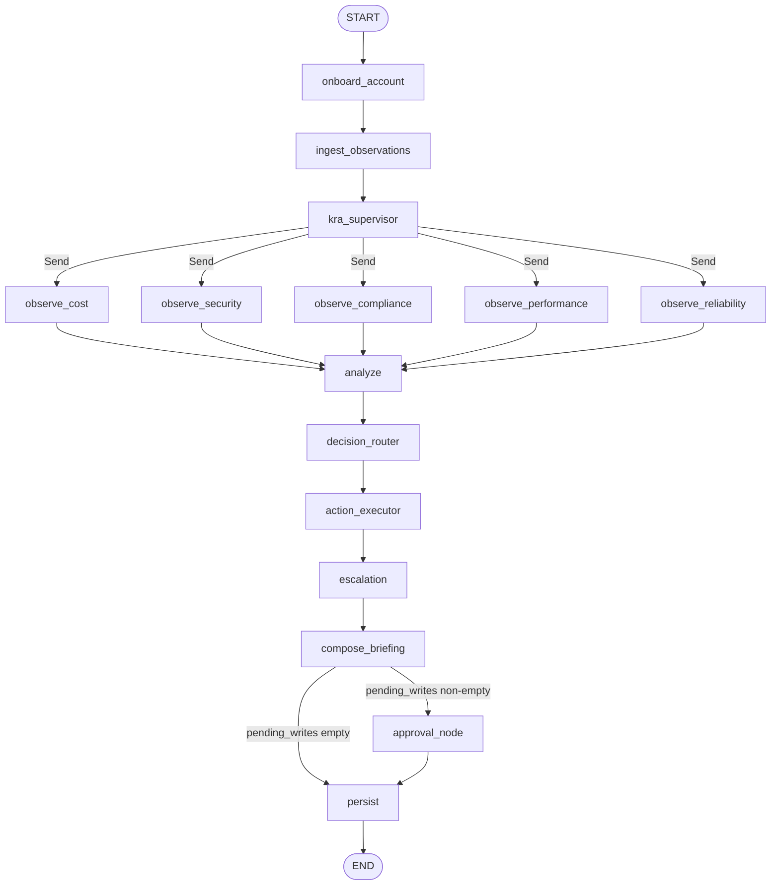

# Chandra Worker Graph — Architecture Reference

Source of truth: `src/chandra/graphs/chandra_graph.py:build_graph`. Diagrams and node
explanations below are derived from the actual edges in `build_graph()` and the
implementations in `src/chandra/graphs/nodes.py` and `src/chandra/graphs/nodes/action_executor.py`.

---

## Architecture diagram (Mermaid — renders in GitHub/IDE)



### ASCII fallback

```
                        ┌──────────────────┐
                        │  ingest_observations│
                        └─────────┬────────┘
                                  │
                                  ▼
                        ┌──────────────────┐
                        │  kra_supervisor  │  (LG-07: returns Send(...) projection)
                        └─────┬──┬──┬──┬──┬┘
                              │  │  │  │  │
                              ▼  ▼  ▼  ▼  ▼
                          cost  sec  cpl  perf  rel
                              │  │  │  │  │
                              └──┴──┴──┴──┘
                                  ▼
                              analyze  (LLM rank + dedup, scorecard)
                                  ▼
                            decision_router
                              (splits into pending_writes + auto_fixed)
                                  ▼
                            action_executor  (consumes auto_fixed)
                                  ▼
                              escalation     (publishes pending_writes to SNS)
                                  ▼
                            compose_briefing  (LLM narrative, markdown + JSON)
                                          │
                              ┌───────────┴────────────┐
                              ▼                        ▼
                          persist                 approval_node  (interrupt for human)
                              ▲                        │
                              └────────────────────────┘
                                          │
                                          ▼
                                         END
```

---

## Node-by-node explanation

### 1. `onboard_account` (`nodes.py:86-103`)

**What it does:** Validates the run, resolves the AWS account, and enumerates active regions.

- Reads `account_id` and `regions` from state; falls back to `factory.account_id()` and
  `active_regions(...)` from `chandra.aws.regions`.
- Seeds empty `raw_findings` and `errors` so reducers downstream start clean.
- **Deterministic.** No LLM, no AWS reads.

### 2. `ingest_observations` (`nodes.py:202-267`)

**What it does:** Pulls CloudWatch metric alarms and EventBridge rules for every region and
writes them to `state.observations: list[Observation]`.

- Uses `paginate()` (the project's paginator wrapper) — never silent truncation.
- Wraps each call in `detector_guard(ctx, ...)` so failures flow into `state.errors` without
  crashing the run.
- Runs in parallel with the KRA observers (no edge dependency between them in the graph).
- **Deterministic AWS reads.**

### 3. `kra_supervisor` + `_route_kra_workers` (`nodes.py:111-137`)

**What it does:** Returns empty state and triggers a `Send(...)` conditional edge to the five
KRA observer nodes.

- This is the **only** `Send(...)` fan-out in the graph (LG-07 optimization).
- Critically, `_route_kra_workers` passes a **slim projection**
  `{run_id, account_id, regions}` instead of the full `ChandraState` — reduces checkpoint
  row size ~4–5x for 1k-resource accounts.
- `merge_raw_findings` (in `state.py`) re-stitches the per-KRA `Finding` lists back together.
- **Deterministic.**

### 4. The five `observe_*` KRA workers (`nodes.py:172-194` + `tools/`)

**What they do:** Run deterministic boto3 detectors for their KRA and return `list[Finding]`.

All five delegate to a shared `_run_observer(kra, state)` that picks the right `KRA_RUNNERS`
entry:

| KRA | Runner |
|---|---|
| `cost` | `tools/cost.py:run_all` |
| `security` | `tools/security.py:run_all` |
| `compliance` | `tools/compliance.py:run_all` |
| `performance` | `tools/performance.py:run_all` |
| `reliability` | `tools/reliability.py:run_all` |

- Returns `{"raw_findings": {kra: findings}, "errors": ctx.errors}`.
- All five are decorated with `@traced_node` → OTEL spans + structlog.
- **Deterministic. The boto3 paginator rule applies here.**

### 5. `analyze` (`nodes.py:318-341`)

**What it does:** Flattens the per-KRA `raw_findings` and calls the LLM to rank + dedup.

- `llm_rank(flat)` is the **only LLM call in the KRA path** (lives in
  `briefing/composer.py`).
- `score_findings(raw)` returns a per-KRA scorecard (deterministic, no LLM).
- Returns `analyzed_findings: list[AnalyzedFinding]` and `scorecard: dict[str,int]`.
- **This is one of the two places Bedrock is allowed to run.** Falls back to a deterministic
  path if Bedrock is unavailable (look for
  `llm.bedrock_unavailable_fallback_to_deterministic` log entries).

### 6. `action_executor` (`graphs/nodes/action_executor.py:action_executor_node`)

**What it does:** Iterates `state["auto_fixed"]` (list of `ProposedWrite` produced by
`decision_router`) and dispatches each write through a local
`detector_id → handler` registry. Emits `list[ActionResult]` to
`state["action_results"]`.

- Three handlers are registered today: `SEC-001-public-s3` → `_fix_public_s3`,
  `SEC-002-open-sg-ssh` → `_fix_open_sg`, `SEC-003-stale-key` → `_disable_iam_key`.
- Other detector ids fall through to `ActionResult(status="skipped", ...)` so the
  audit log is complete even for the 31 detectors that have no fix handler yet.
- Defaults to `dry_run=True`; reads from `state["dry_run"]`. Region is taken from
  `ProposedWrite.region` (not `state["region"]`) so multi-region runs are
  handled correctly.
- Per-write results include `status`, `message`, `error`, `audit_log`, `dry_run`,
  and `executed_at` (UTC).
- **Deterministic.** The low-level `ActionExecutor` class is still mutating
  AWS (when `dry_run=False`); the node is the loop that wraps it. The two
  layers are tested independently: `tests/test_action_executor.py` covers the
  class, `tests/unit/test_action_executor_node.py` covers the node.

> **Resolved (was an architectural concern):** the previous wiring ran
> `action_executor` and `decision_router` as parallel edges out of `analyze`,
> and `action_executor_node` read keys (`action_type`, `resource_id`,
> `problem_type`) that no caller ever set — making it a silent no-op in real
> runs. The current wiring is sequential (`analyze → decision_router →
> action_executor → ...`) and the node consumes `auto_fixed` produced by
> `decision_router`. See `src/chandra/graphs/chandra_graph.py:build_graph`.

### 7. `escalation` (`nodes.py:403-422`)

**What it does:** Publishes a single `EscalationPayload` to SNS for the run.

- Topic ARN comes from `state["sns_topic_arn"]` (defaults to a placeholder ARN).
- ⚠️ **Architectural concern:** the node reads from `state["finding_id"]`,
  `state["resource_id"]`, etc. — keys that are **never set** by upstream nodes. So in its
  current form it publishes a placeholder envelope per run. It should be looping over
  `analyzed_findings` and filtering for `ESCALATE_SEVERITIES` (`{"critical", "high"}`).
  The intent is clear from the constants at the top of `nodes.py`; the implementation is
  a stub.

### 8. `decision_router` (`nodes.py:275-310`)

**What it does:** Classifies each `AnalyzedFinding` into a `ProposedWrite` with
`risk_level` of `"high"` (severity ∈ `{"critical","high"}`) or `"low"`.

- Splits into `pending_writes` (needs human approval) and `auto_fixed` (low-risk).
- ⚠️ **Architectural concern:** `pending_writes` and `auto_fixed` are **not declared in
  `ChandraState` (`state.py:46-63`)**. Runtime works because LangGraph stores them anyway,
  but `mypy --strict` will flag every read. Either they should be added to the
  `TypedDict`, or the nodes should be writing to a known field.

### 9. `compose_briefing` (`nodes.py:349-375`)

**What it does:** Calls `compose_executive_summary()` (LLM narrative) and `render_markdown()`
to produce the final `briefing_md` + `briefing_json`.

- Reads `analyzed_findings`, `scorecard`, `raw_findings`, and `state.errors`.
- **This is the second and final LLM call site** in the graph.

### 10. Conditional edge from `compose_briefing` (`chandra_graph.py:123-131`)

**What it does:** `route_to_approval(state)` checks `state["pending_writes"]`:

- empty → `persist`
- non-empty → `approval_node`

⚠️ **Architectural concern:** `decision_router` and `compose_briefing` are wired as **two
parallel edges out of `analyze`**. LangGraph can run them concurrently, which means the
conditional may evaluate before `pending_writes` is written. In the current code,
`route_to_approval` would then always go to `persist` and the approval flow is effectively
dead. This is the most material issue in the topology.

### 11. `approval_node` (`nodes.py:383-395`)

**What it does:** Uses LangGraph's `interrupt()` to pause the graph and surface
`pending_writes` to the human via the FE approval center.

- On resume, the human's payload is deserialized into `list[ApprovalDecision]` and stored
  as `state["approvals"]`.
- Pass-through (no-op) if no `pending_writes`.

### 12. `persist` (`nodes.py:430-502`)

**What it does:** The **only node allowed to write to Postgres** outside of Alembic
migrations.

- Upserts the `Run` row, replaces all `Finding` rows for this `run_id`, and upserts the
  `Briefing` row.
- Idempotent on `run_id` — re-runs don't duplicate.
- Includes `bedrock_cost_usd` for the pricing telemetry pipeline.

---

## Cross-cutting concerns visible in the code

1. **Reducers in `state.py`** are the merge logic that makes the `Send(...)` fan-out work
   — `merge_raw_findings` and `merge_inventory` deep-merge per-KRA maps; `add` concatenates
   `observations` and `errors`.
2. **Every node is decorated with `@traced_node`** (in
   `src/chandra/observability/callbacks.py`) — adds OTEL spans + structlog + token pricing
   telemetry uniformly. If you add a new node, decorate it.
3. **The `analyze` → `{action_executor, decision_router}` parallel split** is the most
   fragile part of the graph. The intent is clearly: *route high-severity to approval,
   auto-fix low-severity, write everything*. The implementation is currently a *parallel*
   edge rather than a *conditional* one, which means timing-dependent behavior. Worth
   flagging on the next graph refactor ticket.

---

## Summary table

| Node | Deterministic? | AWS calls? | LLM? | Writes Postgres? |
|---|---|---|---|---|
| `onboard_account` | ✅ | read | ❌ | ❌ |
| `ingest_observations` | ✅ | read | ❌ | ❌ |
| `kra_supervisor` | ✅ | ❌ | ❌ | ❌ |
| `observe_{cost,security,compliance,performance,reliability}` | ✅ | read | ❌ | ❌ |
| `analyze` | mixed | ❌ | ✅ (`llm_rank`) | ❌ |
| `action_executor` | ✅ | **mutating** (when `dry_run=False`) | ❌ | ❌ |
| `escalation` | ✅ | mutating (SNS publish) | ❌ | ❌ |
| `decision_router` | ✅ | ❌ | ❌ | ❌ |
| `compose_briefing` | mixed | ❌ | ✅ (`compose_executive_summary`) | ❌ |
| `approval_node` | ✅ (interrupt) | ❌ | ❌ | ❌ |
| `persist` | ✅ | ❌ | ❌ | ✅ |
